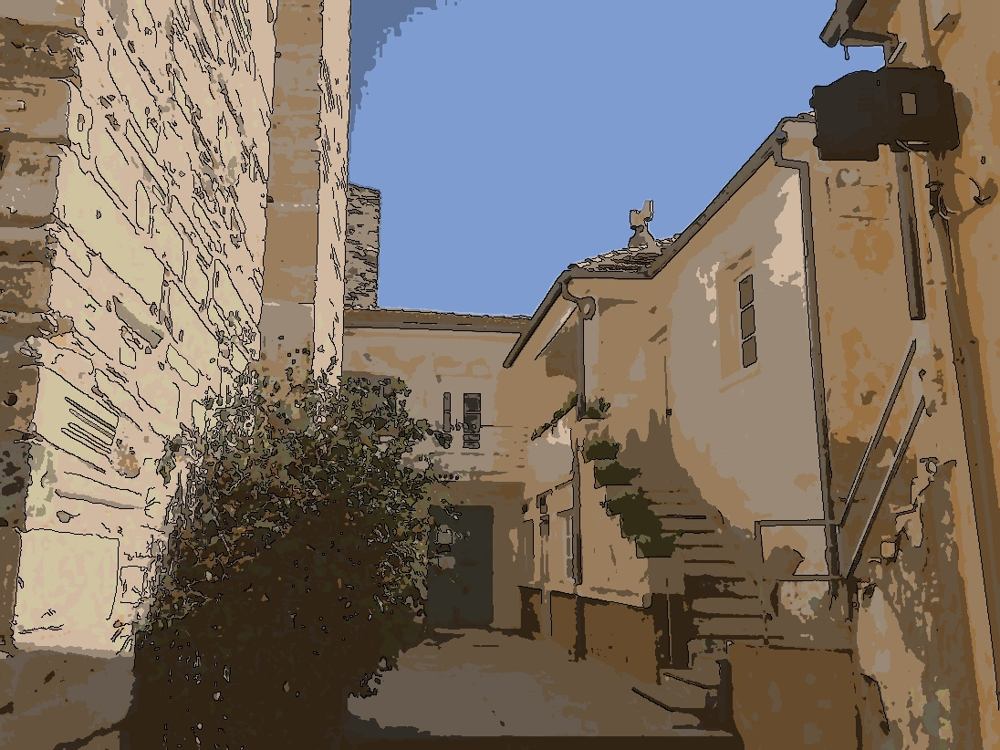

## Cartoonizer
  This tool converts your photo into a cartoon-like image

## Samples
   


   

## Dependences
  + numpy
  + scipy
  + opencv-python

  ```python
  pip install -r requirement.txt
  ```

## How it works
  This cartoonizer uses K-means algorithm to cluster the histogram of image.
  The value K is auto selected by the method in this [[http://papers.nips.cc/paper/2526-learning-the-k-in-k-means.pdf][paper]].
